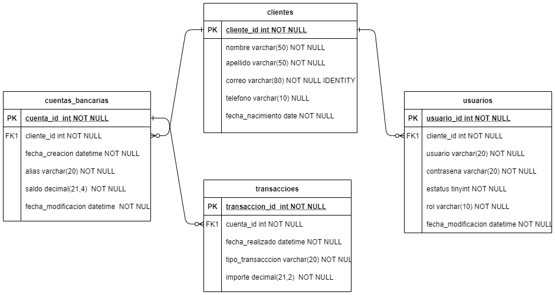

<p align="center"></p>

Actualización al sistema financiero core de gestión de cuentas de ahorro. Controla las operaciones a través de una API la cual se ajusta a las necesidades de la compañia, permitiendo ser competitivo en un mercado en el cual el tiempo de respuesta, confiabilidad y seguridad de la plataforma es fundamental.

## Despliegue en un Entorno Local

Para compilar y ejecutar la aplicación necesitas:

- [JDK 11](https://github.com/AdoptOpenJDK/openjdk11-binaries/releases/download/jdk-11.0.11%2B9/OpenJDK11U-jdk_x64_windows_hotspot_11.0.11_9.msi)
- [Gradle](https://gradle.org/next-steps/?version=7.1.1&format=bin)
- [MySql](https://dev.mysql.com/downloads/mysql/)

Cargar el siguiente esquema de la base de datos en MySql [schema](/assets/schema_blue_bank_v1.sql)

Hay varias maneras de ejecutar una aplicación Spring Boot en el equipo local. Una forma es ejecutar el método en la clase desde el IDE main.java.com.bluebank.backend.bluebankbackend.BlueBankBackendApplication

O Alternativamente puede utilizar Gradle para su ejecución 

```shell
 .\gradlew bootRun 
``` 

## Tecnologias Utilizadas

### Resumen

|Technology                     |Description         |
|-------------------------------|--------------------|
|Core Framework                 |Spring Boot 2.5.2   |
|Capa Persistencia Framework    |Spring Data JPA     |
|Base de Datos                  |MySQL               |

### Datos

|                 Technology                                               |                              Description                        |
|--------------------------------------------------------------------------|-----------------------------------------------------------------|
|<a href="https://www.mysql.com/">MySQL</a>                                |Open-Source Systema de Administracion de Base de Datos Relacional|

### Server - Backend

|                                            Technology                                               |                              Description                                          |
|-----------------------------------------------------------------------------------------------------|-----------------------------------------------------------------------------------|
|<a href="https://adoptopenjdk.net/">Adopt JDK</a>                                                    |Adopt Java™ Open Sorce, Kit de Desarrollo                                          |
|<a href="https://spring.io/projects/spring-boot">Spring Boot</a>                                     |Framework para facilitar el arranque y el desarrollo de nuevas aplicaciones Spring |
|<a href="https://gradle.org/">Gradle</a>                                                             |Administrador de Dependencias                                                      |


###  Libraries and Plugins

|                                      Technology                                               |                              Description                                                                                                                      |
|-----------------------------------------------------------------------------------------------|---------------------------------------------------------|
|<a href="https://projectlombok.org/">Lombok</a>                                                |Generador de metodos de Getter Setter y Constructores    |
|<a href="https://swagger.io/">Swagger</a>                                                      |Open-Source Auto documentación para servicios REST       |


## Arquitectura del Proyecto

* ERR de la base de datos para el manejo de cuentas de ahorro.
  
  [](assets/ERR-bank-account.png)


* La estructura del proyecto es de la siguiente manera:

La elección del patrón mapper fue para no exponer la base de datos completamente así mantener la capa de dominio muy separado de la capa de persistencia.
  
DOMINIO:

- <b>DTO:</b> Objetos del dominio (Contexto de la aplicación)
- <b>Services:</b> Puente entre los controladores y la capa de persistencia.
- <b>Especificación de repositorios:</b> Interfaces que determinan las reglas que debe cumplir la persistencia para actuar entre los objetos de dominio y la DB.

WEB:

- <b>Controller</b>  Controladores de API Rest.

 PERSISTENCIA:

- <b>Repository:</b> Implementan las especificaciones que tiene la capa de DOMINIO.
- <b>Entities:</b> Mapean y actúan como tablas de la DB.
- <b>Mapper:</b> Traductor de objetos DTO a Entity

## MEJORAS A FUTURO

 1. Realizar los test del sistema, eran requerimientos tecnicos pero no se lograron realizar.
 2. Implementar la autenticación con JWT ya que en el esquema inicial se contemplo no era requirimiento pero si era necesaria su implementación
 3. Manejo de Actualizaciones en Alias de Cuentas de Ahorro
 4. Obtención de transacciones limitado por fechas.
 5. UNa mejor estrcutura de la base de datos para que sea mas escalable.

##BONUS 

Se comparte la colección de Postman para comprobrar el funcionamientos de los servicios REST.

[Descargar aquí](/assets/BlueBank%20Backend.postman_collection.json)

Video demostrativo del funcionamiento de la Api Rest 

[Video Demostrativo](https://youtu.be/13eU7ItJmsY)

----- 

*Desarrolado por Luis E. García <a href="mailto:elcorreoquequieres@correo.com">📧 Mail</a>*

*Desarrollando software con ♥ desde El Salvador*
